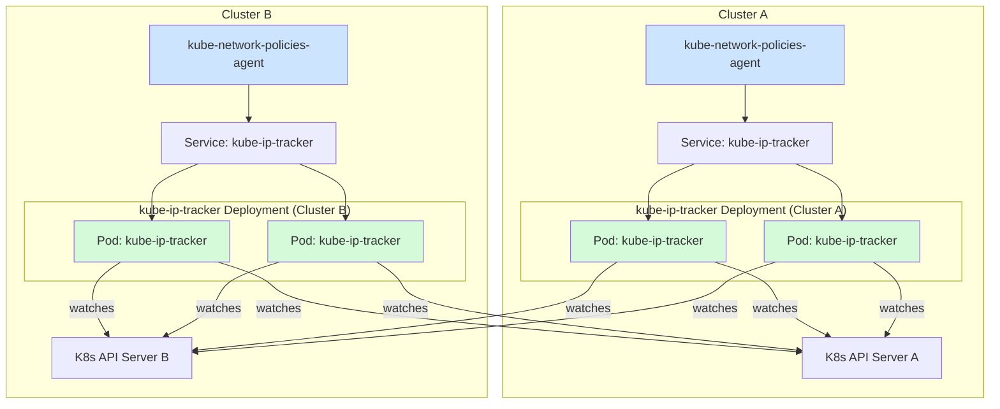
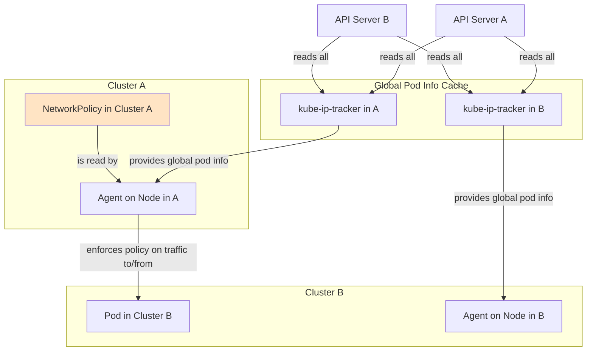
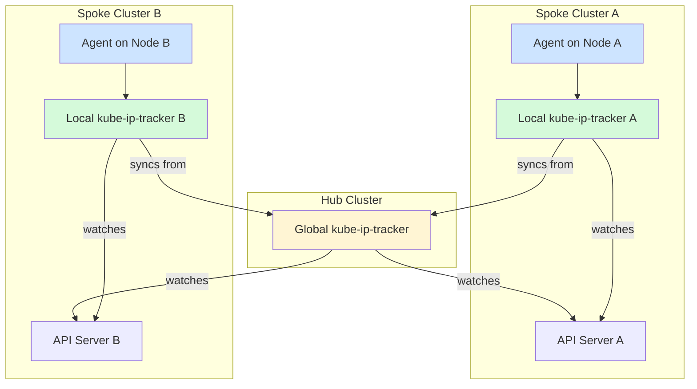

# Multi-Cluster Kubernetes Network Policies

## Introduction to kube-network-policies

The [`kube-network-policies`](https://github.com/kubernetes-sigs/kube-network-policies) project is the reference implementation for Kubernetes NetworkPolicy enforcement. It provides a policy engine that runs as an agent on each node in a cluster, intercepting traffic and applying [Network Policy rules using the Kubernetes core API](https://kubernetes.io/docs/concepts/services-networking/network-policies/), see [Kube-network-policies A Developer's Intro](https://docs.google.com/presentation/d/1sN_J0OHePkl_ZAXTKPH-CEFGZ34NPo22axoDhC36zGo/edit?usp=sharing).

The project supports two primary deployment models:

1. **Standalone Mode:** Each agent on every node independently watches all Pods, Namespaces, and NetworkPolicy objects in the cluster. While simple, this model does not scale well in large clusters. The number of watches places a significant load on the Kubernetes API server, as each node maintains its own complete cache of the cluster state.  
2. **Centralized Cache Mode:** To solve the scalability problem, this model introduces `kube-ip-tracker` as an intermediate cache. Instead of every node agent watching the API server directly, a few `kube-ip-tracker` pods do so. The node agents then connect to the `kube-ip-tracker` to get the necessary pod metadata, see [Scalable Pod Info for Kubernetes Networking](https://docs.google.com/presentation/d/1gtqbMxhtAcsTH7jCz38EMZP0rp682wLslat7v8O0UFY/edit?usp=sharing)for more information on the design of the distributed cache.

This implementation extends the centralized cache model for multi-cluster environments.

### The Multi-Cluster Solution with kube-ip-tracker

The `kube-ip-tracker` application is designed to act as a central metadata store that can watch multiple Kubernetes clusters simultaneously. It aggregates information about all pods (IPs, labels, namespaces, etc.) from all configured clusters into a single, unified cache.

The `kube-network-policies` agent running on each node then connects to this central `kube-ip-tracker` service. This architecture provides the node agents with a global view of all pods across all clusters, which is the key to enabling multi-cluster network policies.

### Enabling Multi-Cluster NetworkPolicy

With a global cache of pod information, the policy engine on each node can apply standard Kubernetes `NetworkPolicy` rules to traffic coming from pods in other clusters. This is based on a simple but powerful model:

* **Policies are Local:** A `NetworkPolicy` resource is only applied to the cluster where it is created. Policies are not replicated across clusters.  
* **Selectors are Global:** The policy engine within a cluster evaluates rules against all known pods and namespaces from the entire set of monitored clusters (the "ClusterSet").

This allows an administrator to write a policy in `cluster-a` that selects pods in `cluster-b` as a valid traffic source. To make this work effectively, it is recommended to adopt a consistent labeling scheme for cluster identification, as proposed in [NPEP-311](https://github.com/kubernetes-sigs/network-policy-api/pull/313).

**Recommended Practice:** Each namespace should be labeled by the administrator with the identifier of the cluster it belongs to. The recommended label is:

`cluster.clusterset.k8s.io: <cluster-id>`

This enables policy authors to create selectors that precisely target peers from specific clusters. For example, to allow ingress from any pod in the `backend` namespace from the `cluster-b`, you could write a policy like this:

```yaml
kind: NetworkPolicy
apiVersion: networking.k8s.io/v1
metadata:
  name: allow-from-cluster-b-backend
spec:
  podSelector:
    matchLabels:
      app: database
  ingress:
  - from:
    - namespaceSelector:
        matchLabels:
          kubernetes.io/metadata.name: backend
          cluster.clusterset.k8s.io: cluster-b
```

## Multi-Cluster Deployment Architecture

The flexible design of the distributed cache allows for various deployment architectures depending on specific needs for redundancy, performance, and failure domains. For this guide, we will use a **Full Mesh** architecture.

### Full Mesh Model

In a full mesh model, **each cluster runs its own independent `kube-ip-tracker` deployment**. This deployment acts as the local source of truth for the policy agents running within that same cluster.

Each of these `kube-ip-tracker` deployments is configured to watch the API servers of **all** clusters in the mesh (including its own). This way, every cluster builds its own complete, aggregated cache of the entire multi-cluster environment.



#### Advantages of the Full Mesh Model

* **High Availability:** The `kube-ip-tracker` service is deployed redundantly within each cluster, typically behind a headless service.  
* **Reduced Blast Radius:** If the `kube-ip-tracker` in Cluster A fails or loses connectivity to Cluster B's API server, policy enforcement for traffic *within* Cluster A is completely unaffected. The agents in Cluster A will continue to function correctly for local traffic using their local cache. Only cross-cluster policies originating from Cluster A would be impacted.

#### Conceptual Data Flow

The diagram below illustrates how a policy in one cluster can use the globally-aware cache to enforce rules on traffic from another cluster.



### Alternative: Hub and Spoke Model

For environments with a very large number of clusters, a full mesh can become a bottleneck, as each `kube-ip-tracker` instance must maintain connections to every API server. The **Hub and Spoke** architecture provides a more scalable alternative.

* **Hub Cluster:** A dedicated cluster runs a **global `kube-ip-tracker`** deployment. This instance is the only component that connects to the API servers of all other clusters (the "spokes"). It aggregates all pod information into a central, global cache.  
* **Spoke Clusters:** Each spoke cluster runs a **local `kube-ip-tracker`** that watches two sources:  
  1. Its **own local API server** for immediate updates on local pods.  
  2. The service endpoint of the **global `kube-ip-tracker`** in the hub cluster to receive information about all other clusters.

The `kube-network-policies` agents on the nodes of a spoke cluster only need to connect to their local `kube-ip-tracker`.



#### Advantages of the Hub and Spoke Model

* **Reduced Connection Overhead:** Drastically reduces the number of cross-cluster connections. Each local tracker only maintains one connection to the hub, and only the central hub tracker connects to all clusters.  
* **Centralized Management:** The configuration of the entire multi-cluster set can be managed from the central hub tracker's deployment.

## GKE Deployment Guide with Workload Identity

This section details the steps to deploy the `kube-ip-tracker` application on a Google Kubernetes Engine (GKE) cluster. The application uses GKE Workload Identity to securely authenticate with the Google Cloud APIs and fetch connection details for other GKE clusters.

### Core Concepts

The authentication model relies on two distinct identities and permission sets:

1. **Google Service Account (GSA):** An identity within Google Cloud. We will create a dedicated GSA for the tracker.  
   * **Permissions:** This account needs Google Cloud IAM permissions to interact with the GKE API (`container.viewer` role) to fetch the endpoints and CAs of the target clusters and `container.clusterViewer` to watch Pods, Nodes, and Namespaces of the target clusters.  
2. **Kubernetes Service Account (KSA):** An identity within the Kubernetes cluster, defined in the deployment manifest (`kube-ip-tracker` in `kube-system`).  
   * **Permissions:** This account also needs Kubernetes RBAC permissions (via a `ClusterRole` and `ClusterRoleBinding`) to watch Pods, Nodes, and Namespaces **within** each of the target clusters it connects to.

**Workload Identity** acts as the bridge, allowing the KSA to impersonate the GSA.

### Prerequisites

* A GKE cluster with Workload Identity enabled.

[`https://cloud.google.com/kubernetes-engine/docs/how-to/workload-identity?cloudshell=false#enable_on_clusters_and_node_pools`](https://cloud.google.com/kubernetes-engine/docs/how-to/workload-identity?cloudshell=false#enable_on_clusters_and_node_pools) 

* The `gcloud` command-line tool authenticated to your Google Cloud project.  
* The `kubectl` command-line tool is configured to connect to your clusters.

### Create a Dedicated Google Service Account (GSA)

Follow steps as in:  
[https://cloud.google.com/kubernetes-engine/docs/how-to/workload-identity\#configure-authz-principals](https://cloud.google.com/kubernetes-engine/docs/how-to/workload-identity#configure-authz-principals)

Create a dedicated GSA for the tracker. Replace `GSA_NAME` and `GCP_PROJECT_ID` with your values.

```sh
# Define variables
export GSA_NAME="kube-ip-tracker-gsa"
export GCP_PROJECT_ID="genai01" # Replace with your GCP Project ID

# Create the Google Service Account
gcloud iam service-accounts create ${GSA_NAME} \
    --project=${GCP_PROJECT_ID}

```

### Grant IAM Permissions to the GSA

The GSA needs permission to get the details of the GKE clusters you want to monitor. The `roles/container.viewer` role provides the necessary permissions (`container.clusters.get`). Grant this role to the GSA on each project that contains target GKE clusters.

```sh
# Grant the GSA the container.clusterViewer role
gcloud projects add-iam-policy-binding ${GCP_PROJECT_ID} \
    --member "serviceAccount:${GSA_NAME}@${GCP_PROJECT_ID}.iam.gserviceaccount.com" \
    --role "roles/container.clusterViewer"

# Grant the GSA the container.viewer role
gcloud projects add-iam-policy-binding ${GCP_PROJECT_ID} \
    --member "serviceAccount:${GSA_NAME}@${GCP_PROJECT_ID}.iam.gserviceaccount.com" \
    --role "roles/container.viewer"
```

### Link the GSA to the Kubernetes Service Account (KSA)

Create an IAM policy binding that allows the KSA (`kube-ip-tracker` in the `kube-system` namespace) to impersonate the GSA. This is the core of the Workload Identity configuration.

```sh
# Allow the KSA to impersonate the GSA
gcloud iam service-accounts add-iam-policy-binding \
  "${GSA_NAME}@${GCP_PROJECT_ID}.iam.gserviceaccount.com" \
  --role "roles/iam.workloadIdentityUser" \
  --member "serviceAccount:${GCP_PROJECT_ID}.svc.id.goog[kube-system/kube-ip-tracker]"

```

### Deploy the Application Manifest

Apply the install manifest from this repository to all your clusters:

```sh
kubectl apply -f ./install.yaml
```

### Annotate the KSA to Complete the Link

The final step is to annotate the KSA in Kubernetes, telling it which GSA to use. This activates Workload Identity for any pod using this KSA.

```sh
# Annotate the KSA
kubectl annotate serviceaccount kube-ip-tracker \
    --namespace kube-system \
    iam.gke.io/gcp-service-account=${GSA_NAME}@${GCP_PROJECT_ID}.iam.gserviceaccount.com
```

### Step 6: Verification

Check the logs of the `kube-ip-tracker` pod to confirm it is fetching details for the configured clusters.

```sh
kubectl logs -n kube-system -l app=kube-ip-tracker -f
```

You should see output similar to this:

```sh
I0912 15:40:23.805943       1 main.go:345] Fetching details for 2 GKE clusters...
I0912 15:40:24.123980       1 main.go:205] Successfully fetched details for 2 clusters.
I0912 15:40:24.124016       1 main.go:215] New cluster configured: gke_genai01_us-central1_gke-mc-01-us-central1-2. Starting watcher.
I0912 15:40:24.124042       1 main.go:215] New cluster configured: gke_genai01_us-central1_gke-mc-01-us-central1-1. Starting watcher.
I0912 15:40:24.206853       1 main.go:252] Successfully connected to cluster gke_genai01_us-central1_gke-mc-01-us-central1-1 (UID: 6d720c21-23f4-4c97-9116-044c264ebc0f). Starting informers...
I0912 15:40:24.213227       1 main.go:252] Successfully connected to cluster gke_genai01_us-central1_gke-mc-01-us-central1-2 (UID: 5b6390e0-7f8b-44b6-ae6d-b7d3cf1b5d13). Starting informers...
I0912 15:40:24.215094       1 reflector.go:436] "Caches populated" type="*v1.Node" reflector="pkg/mod/k8s.io/client-go@v0.34.0/tools/cache/reflector.go:290"
I0912 15:40:24.215576       1 reflector.go:436] "Caches populated" type="*v1.Namespace" reflector="pkg/mod/k8s.io/client-go@v0.34.0/tools/cache/reflector.go:290"
I0912 15:40:24.223989       1 reflector.go:436] "Caches populated" type="*v1.Namespace" reflector="pkg/mod/k8s.io/client-go@v0.34.0/tools/cache/reflector.go:290"
I0912 15:40:24.225343       1 reflector.go:436] "Caches populated" type="*v1.Node" reflector="pkg/mod/k8s.io/client-go@v0.34.0/tools/cache/reflector.go:290"
I0912 15:40:24.238777       1 reflector.go:436] "Caches populated" type="*v1.Pod" reflector="pkg/mod/k8s.io/client-go@v0.34.0/tools/cache/reflector.go:290"
I0912 15:40:24.245273       1 reflector.go:436] "Caches populated" type="*v1.Pod" reflector="pkg/mod/k8s.io/client-go@v0.34.0/tools/cache/reflector.go:290"
```

## Demo: Multi-Cluster Network Policy

This demo walks through applying a `NetworkPolicy` in one cluster that affects traffic from another cluster.

**Prerequisites:**

* You have two GKE clusters. We will refer to them as `cluster-1` and `cluster-2`, corresponding to the names configured in the `--gcp-cluster-names` flag.  
* Your `kubeconfig` is set up with contexts for both clusters (e.g., `gke_genai01_us-central1_gke-mc-01-us-central1-1` and `gke_genai01_us-central1_gke-mc-01-us-central1-2`).

#### Setup Demo Pods and Namespaces

First, create a namespace in each cluster and label them to identify their parent cluster.

```sh
# Set variables for your cluster contexts and names
export CTX_C1="gke_genai01_us-central1_gke-mc-01-us-central1-1"
export CLUSTER_NAME_C1="gke-mc-01-us-central1-1"
export CTX_C2="gke_genai01_us-central1_gke-mc-01-us-central1-2"
export CLUSTER_NAME_C2="gke-mc-01-us-central1-2"

# Create and label namespace in Cluster 1
kubectl --context=${CTX_C1} create ns demo-c1
kubectl --context=${CTX_C1} label ns demo-c1 cluster.clusterset.k8s.io=${CLUSTER_NAME_C1}

# Create and label namespace in Cluster 2
kubectl --context=${CTX_C2} create ns demo-c2
kubectl --context=${CTX_C2} label ns demo-c2 cluster.clusterset.k8s.io=${CLUSTER_NAME_C2}

# Deploy a web server pod in each cluster
kubectl --context=${CTX_C1} -n demo-c1 run web-c1 --image=registry.k8s.io/e2e-test-images/agnhost:2.39 --labels="app=web" --expose --port=80 -- netexec --http-port=80
kubectl --context=${CTX_C2} -n demo-c2 run web-c2 --image=registry.k8s.io/e2e-test-images/agnhost:2.39 --labels="app=web" --expose --port=80 -- netexec --http-port=80
```

#### Test Initial Connectivity

Before any policies are applied, traffic should be allowed.

```sh
# Get the IP of the web server in Cluster 2
export WEB_C2_IP=$(kubectl --context=${CTX_C2} -n demo-c2 get pod -l app=web -o jsonpath='{.items[0].status.podIP}')

# Try to connect from a temporary pod in Cluster 1
# This should succeed and output the other pod name
kubectl --context=${CTX_C1} -n demo-c1 run tmp-client --rm -it --image=busybox -- sh -c "wget -qO- --timeout=2 http://${WEB_C2_IP}/hostname"

```

#### Apply a Default Deny Policy in Cluster 2

Now, apply a policy in `cluster-2` to deny all ingress traffic to the `web-c2` pod.

```sh
# Apply a default-deny policy in cluster-2
kubectl --context=${CTX_C2} -n demo-c2 apply -f - <<EOF
apiVersion: networking.k8s.io/v1
kind: NetworkPolicy
metadata:
  name: default-deny-ingress
spec:
  podSelector:
    matchLabels:
      app: web
  policyTypes:
  - Ingress
EOF

# Wait a moment for the policy to be enforced
sleep 5

# Test connectivity again. This should time out.
kubectl --context=${CTX_C1} -n demo-c1 run tmp-client --rm -it --image=busybox -- sh -c "wget -qO- --timeout=2 http://${WEB_C2_IP}"

```

This demonstrates that a local policy in `cluster-2` is enforced against traffic originating from `cluster-1`.

#### Apply a Multi-Cluster Allow Policy

Finally, update the policy in `cluster-2` to explicitly allow traffic from pods in the `demo-c1` namespace *that belong to `cluster-1`*.

```sh
# Update the policy in cluster-2
kubectl --context=${CTX_C2} -n demo-c2 apply -f - <<EOF
apiVersion: networking.k8s.io/v1
kind: NetworkPolicy
metadata:
  name: default-deny-ingress
spec:
  podSelector:
    matchLabels:
      app: web
  policyTypes:
  - Ingress
  ingress:
  - from:
    - namespaceSelector:
        matchLabels:
          # Selects namespaces with this label
          cluster.clusterset.k8s.io: ${CLUSTER_NAME_C1}
          # AND this label
          kubernetes.io/metadata.name: demo-c1
EOF

# Wait a moment for the policy to update
sleep 5

# Test connectivity one last time. It should now succeed
kubectl --context=${CTX_C1} -n demo-c1 run tmp-client --rm -it --image=busybox -- sh -c "wget -qO- --timeout=2 http://${WEB_C2_IP}/hostname"

```

You have now successfully enforced a network policy across cluster boundaries.

#### Cleanup

Remove the demo resources from both clusters.

```sh
kubectl --context=${CTX_C1} delete ns demo-c1
kubectl --context=${CTX_C2} delete ns demo-c2
```
